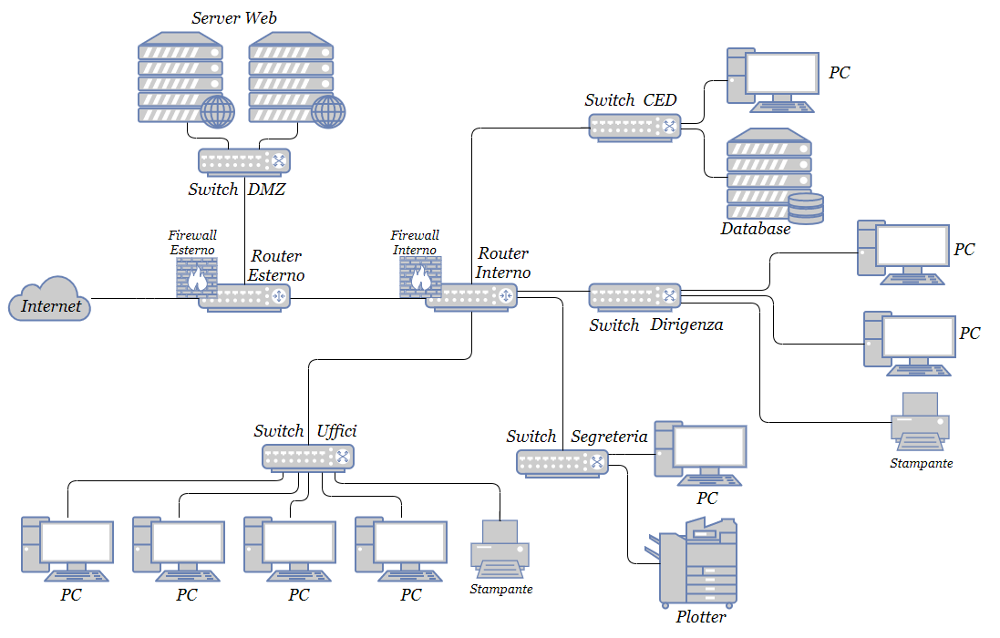

# Documentazione

# 1. Il progetto
Creare un sito web per la gestione di un medagliere delle olimpiadi.

L'ambito del progetto potrebbe essere quello di un'azienda che gestisce le statistiche dei vincitori delle olimpiadi ( solamente chi rientra nel podio ) e magari di fornire, attraverso delle `API`, i dati a terzi parti.

## 1.1. Schema Entity Relationships (E/R)


La relazione che si crea tra `sports e discipline è di 1 a N` ( a uno sport corrispondono una o più discipline, ma ad un disciplina corrisponde uno ed uno solo sport ).

La relazione che si crea tra `nazioni e discipline è N a N` ( ad una nazione corrispondono una o più discipline e viceversa ).

## 1.2. Schema Logico


## 1.3. Vincoli
Dallo schema logico possiamo vedere alcuni `vincoli di integrità referenziale` ( FK ) quali:
- Nazioni -> Medaglie;
- Discipline -> Medaglie;
- Sports -> Discipline.

Questi permettono di assicurare la `consistenza` dei dati all'interno del database, non permettendo, ad esempio, l'eliminazione di un dato che è collegato (attravereso le chiavi primarie - esterne) ad un'altra tabella. (es. Non posso eliminare uno sport se questo ha delle discipline a lui collegate).

Inoltre vi si trova un `vincolo di dominio` nel campo `medaglia` della tabella `medaglie`: esso può assumere solamente valori numerici di tipo intero da 1 a 3 ( estremi compresi, ma è presente un controllo che impedisce l'inserimento di valori estranei a questo vincolo ).

L'univocità di ogni record è possibile grazie alle `chiavi primarie` presenti in ogni tabella ( PK ). Non è presente il controllo sui valori immessi durante l'inserimento e la modifica, per tanto bisogna fare attenzione durante queste due fasi.

## 1.4. I Linguaggi
Ho scelto `PHP` ( Personal Home Page inizialmente, poi modificato in Hypertext Preprocessor ), un linguaggio di scripting lato server interpretato, in quanto molto semplice ed adatto per lo sviluppo dell'intero progetto. 
Avendo un alto grado di portabilità infatti, esso è perfetto per quasi qualsiasi piattaforma, sia quando si parla di sistemi operativi, sia quando si parla di web server.

Inoltre sono presenti altri linguaggi come `CSS` ( Cascading Style Sheets ) e `JavaScript` ( ECMA Script ), entrambi utilizzati dal framework [Bootstrap](https://getbootstrap.com/), che è stato utile per realizzare l'interfaccia grafica.

Per interfacciarmi con il database ho utilizzato il linguaggio `SQL` ( Structured Query Language ), inserendo le istruzioni in apposite funzioni offerte da PHP.

## 1.5. DBMS (Data Base Management System)
Per gestire la persistenza dei dati è stato utilizzato un `DBMS`, ossia un programma applicativo che si interpone tra l'applicazione e i file dove sono memorizzati i dati ( che si interfaccia con il file system ).

I vantaggi sono molteplici: 
- Eliminazione delle ridondanze ( dato che deriva dall'elaborazione di altri );
- Eliminazione delle inconsistenze ( due valori che rappresentano la stessa informazione, assumono valori diversi );
- Integrità dei dati ( vedi paragrafo `Vincoli` ).

Il DBMS in questione è `MySQL`, o meglio un `RDBMS`, ossia un database relazionale, che ha come principio base quello di essere intuitivo e diretto nella rappresentazione dei dati nelle tabelle, rendendo facile stabilire anche le relazioni.

## 1.6. Base di dati in linguaggio SQL
```sql
-- Creazione tabella `sports`
CREATE TABLE sports(
    idSport int(11) auto_increment not null primary key,
    sport varchar(30) not null
)

-- Creazione tabella `discipline`
CREATE TABLE discipline(
    idDisciplina int(11) auto_increment not null primary key,
    disciplina varchar(30) not null,
    icona varchar(50),
    idSport int(11) not null,
    foreign key (idSport) references sports(idSport)
)

-- Creazione tabella `nazioni`
CREATE TABLE nazioni(
    idNazione int(11) auto_increment not null primary key,
    nazione varchar(30) not null,
    icona varchar(50)
)

-- Creazione tabella `medaglie`
CREATE TABLE medaglie(
    idMedaglia int(11) auto_increment not null primary key,
    data date not null,
    medaglia tinyint not null,
    idNazione int(11) not null,
    idDisciplina int(11) not null,
    foreign key (idNazione) references nazioni(idNazione),
    foreign key (idDisciplina) references discipline(idDisciplina)
)
```
Nello script di inizializzazione del database, all'interno del codice, è stata inserita, successivamente ad ogni istruzione `CREATE TABLE`, l'istruzione `IF NOT EXISTS` per evitare la cancellazione, per errore, di tutti i dati, con conseguente (possibile) inconsistenza dei dati.

# 2. Requisiti
Lo sviluppo dell'applicazione è stato effettuato attraverso il web server [XAMPP](https://www.apachefriends.org/it/index.html), versione `7.4.5`, che comprende al suo interno:
- MariaDB `10.4.11` ( fork di `MySQL` versione `5.6` );
- PHP `7.4.5`.

Il deploy dell'intero sito invece, è stato fatto su [Altervista](https://it.altervista.org), all'indirizzo  [rangomatteo.altervista.org](https://rangomatteo.altervista.org), server che contiene:
- MySQL `5.6`;
- PHP `7.3`.

Entrambe le versioni, sia per quanto riguarda `PHP`, sia per quanto riguarda `MySQL`/`MariaDB`, sono compatibili tra loro quindi, non c'è stato bisogno di effettuare modifiche nel passaggio dallo sviluppo al deploy. Il motore utilizzato è `InnoDB`, scelto per la caratteristica fondamentale di permettere la creazione delle `foreign keys`, che conferiscono la possibilità di creare una relazione logica tra due ( o più ) tabelle, in modo da rendere consistenti i dati ( vedi sezione `vincoli` ).

Il caricamento dei file nel server di Altrvista è stato effettuato attraverso il protocollo `FTP` con il programma [FileZilla](https://filezilla-project.org/) per poi renderlo automatico grazie a Github (Github Actions).

# 3. Rete della realtà di riferimento
Si pensa di creare una rete interna per l'azienda, che offrirà i servizi agli utenti attraverso una rete di elaboratori. Di seguito la rappresentazione logica:



# 3.1. Connessioni e apparecchiatura di rete
Il progetto richiede l'utilizzo di 5 switch e 2 router per collegare:
- 8 PC;
- 2 stampanti;
- 1 plotter;
- 3 server;

suddivisi in diverse sale quali:
- Sala CED ( Centro Elaborazinone Dati, 1° Piano );
- Sala Segreteria ( 1° Piano );
- Sala Dirigenza ( 2° Piano );
- Uffici ( 2° Piano ). 

Per tutte le connessione si propongono cavi `F/UTP`( Foiled Unshielded Twisted Pair ) `Cat.6`, solitamente usati per Fast Ethernet( 100 Mbps ) e 10-Gigabit Ethernet( 10000 Mbps ) di reti aziendali di piccole e medie dimensioni; essi sono infatti più performanti rispetto alle precedenti categorie ( grazie ad un separatore interno ed un rivestimento che avvolge le 8 coppie di doppini ).

Data la semplicità della rete, non si prevede un server DHCP (Dynamic Host Configuration Protocol) e non si prevede una rete wireless all'interno degli uffici, questo per evitare accessi non autorizzati e/o sniffing indesiderato.

# 3.2. Servizi verso l'esterno
Come già citato in precedenza, si vuole offrire agli utenti una serie di servizi attraverso i web servers, che saranno posti all'interno di una `DMZ` ( DeMilitarized Zone ), questo per rendere sicura la rete aziendale interna.
In pratica si crea la cosidetta `zona cuscinetto`, una zona con traffico strettamente limitato e controllato.
Il database sarà posto invece all'interno della rete aziendale, questo perché solamente il web server dovrà accedervi direttamente, e lo farà tramite determinate regole dettate dal firewall interno.

# 3.3. Data Center
Si preferisce in questo caso adottare una soluzione interna per numerosi motivi, primo tra tutti la rapidità con la quale è possibile agire fisicamente sulle macchine in caso di malfunzionamento. Fornendo API verso l'esterno infatti, è necessario che il down-time sia minimizzato.
Per poter usufruire delle API poi, sarà necessario che l'utente si registri e di conseguenza si autentichi, pertanto si prevede l'immagazzinamento di dati sensibili. Avere i server interni quindi significherebbe avere sotto controllo tali dati e poter impliementare le proprie politiche di sicurezza.
