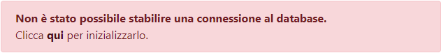

# 1. Requisiti
Lo sviluppo dell'applicazione è stato effettuato attraverso il web server [XAMPP](https://www.apachefriends.org/it/index.html), versione `7.4.5`, che comprende al suo interno:
* MariaDB `10.4.11` (fork di `MySQL` versione `5.6`);
* PHP `7.4.5`;

Il deploy dell'intero sito invece, è stato fatto su [Altervista](https://it.altervista.org), all'indirizzo  [rangomatteo.altervista.org](rangomatteo.altervista.org), server che contiene:
* MySQL `5.6`;
* PHP `7.3`;

Entrambe le versioni, sia per quanto riguarda `PHP`, sia per quanto riguarda `MySQL`/`MariaDB`, sono compatibili tra loro quindi, non c'è stato bisogno di effettuare modifiche nel passaggio dallo sviluppo al deploy. Il caricamento dei file nel server di Altrvista è sempre stato effettuato attraverso il protocollo `FTP`.

## Test in locale:
Provare il sito in un ambiente locale è possibile seguendo questi semplici passaggi:
1. Scaricare tutti i file e copiarli nella directory dedicata nel proprio web server;
2. Creare nella root principale un file chiamato `dati.php` e incollare al suo interno il seguente codice:
    ```php
    <?php
        $host = "iltuohostname.it";
        $user = "username";
        $pwd = "password";
        $schema = "nome_del_database";
    ?>
    ```
    Modificare quindi **SOLO IL VALORE** delle variabili secondo le proprie esigenze.

    **ATTENZIONE**: inserisci il nome del database nella variabile `$schema` anche se non esiste ancora, vedremo nei prossimi punti come crearlo;
3. A questo punto avviare il web server ed accedere al sito tramite browser;
4. Se tutto è andato a buon fine, dovreste trovarvi ad una pagina il cui        messaggio è il seguente:

    

    Non vi preoccupate, è normale dal momento che non abbiamo ancora creato il nostro database.
5. Dal menù in alto selezionate la voce `Operazioni DB`

    

    Vi apparirà questa "tendina":

    

    Ora partendo dall'alto verso il basso cliccate su tutte le voci presenti.
6. Se tutti i passaggi andranno a buon fine (indicati da un messaggio a sfondo verde al termine dell'operazione), il vostro database e le tabelle saranno pronte all'utilizzo.
