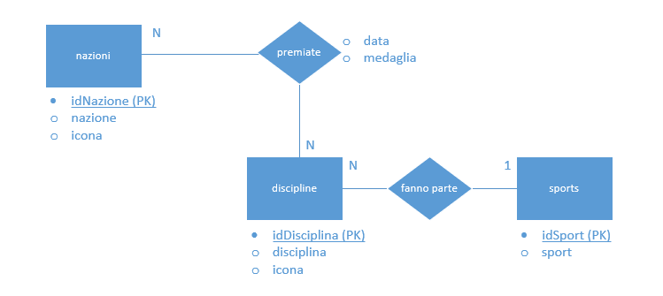

# INDICE
[1. Requisiti](#1.-requisiti)

&nbsp;&nbsp;&nbsp;&nbsp;&nbsp;&nbsp;[1.1. Test in locale](#test-in-locale)

[2. Il progetto](#2.-il-progetto)

&nbsp;&nbsp;&nbsp;&nbsp;&nbsp;&nbsp;[2.1. Schema Entity Relationships](#schema-entity-relationships-(e/r))

&nbsp;&nbsp;&nbsp;&nbsp;&nbsp;&nbsp;[2.2. Schema Logico](#schema-logico)

&nbsp;&nbsp;&nbsp;&nbsp;&nbsp;&nbsp;[2.3. Vincoli](#vincoli)

&nbsp;&nbsp;&nbsp;&nbsp;&nbsp;&nbsp;[2.4. Il Linguaggio](#il-linguaggio)

# 1. Requisiti
Lo sviluppo dell'applicazione è stato effettuato attraverso il web server [XAMPP](https://www.apachefriends.org/it/index.html), versione `7.4.5`, che comprende al suo interno:
* MariaDB `10.4.11` (fork di `MySQL` versione `5.6`);
* PHP `7.4.5`;

Il deploy dell'intero sito invece, è stato fatto su [Altervista](https://it.altervista.org), all'indirizzo  [rangomatteo.altervista.org](rangomatteo.altervista.org), server che contiene:
* MySQL `5.6`;
* PHP `7.3`;

Entrambe le versioni, sia per quanto riguarda `PHP`, sia per quanto riguarda `MySQL`/`MariaDB`, sono compatibili tra loro quindi, non c'è stato bisogno di effettuare modifiche nel passaggio dallo sviluppo al deploy. Il motore utilizzato è `InnoDB`, scelto per la caratteristica fondamentale di permettere la creazione delle `foreign keys`, che conferiscono la possibilità di creare una relazione logica tra due (o più) tabelle, in modo da rendere consistenti i dati (vedi [vincoli](#vincoli)).

Il caricamento dei file nel server di Altrvista è sempre stato effettuato attraverso il protocollo `FTP`.

## 1.1 Test in locale:
Provare il sito in un ambiente locale è possibile seguendo questi semplici passaggi:
1. Scaricare tutti i file e copiarli nella directory dedicata nel proprio web server;
2. Creare nella root principale un file chiamato `dati.php` e incollare al suo interno il seguente codice:
    ```php
    <?php
        $host = "iltuohostname.it";
        $user = "username";
        $pwd = "password";
        $schema = "nome_del_database";
    ?>
    ```
    Modificare quindi **SOLO IL VALORE** delle variabili secondo le proprie esigenze.

    **ATTENZIONE**: inserisci il nome del database nella variabile `$schema` anche se non esiste ancora, vedremo nei prossimi punti come crearlo;
3. A questo punto avviare il web server ed accedere al sito tramite browser;
4. In caso di successo, dovreste trovarvi ad una pagina il cui messaggio è il seguente:

    

    Non vi preoccupate, è normale dal momento che non abbiamo ancora creato il nostro database.
5. Dal menù in alto selezionate la voce `Operazioni DB`

    

    Vi apparirà questa "tendina":

    

    Ora partendo dall'alto verso il basso cliccate su tutte le voci presenti.
6. Se tutti i passaggi andranno a buon fine (indicati da un messaggio a sfondo verde al termine dell'operazione), il vostro database e le tabelle saranno pronte all'utilizzo.

# 2. Il progetto
Creare un sito web per la gestione di un medagliere delle olimpiadi.

Creare tutte le pagine web necessarie alla gestione delle varie tabelle. In particolare, la pagina di inserimento dei dati, relativi alle medaglie, dovrà mostrare un menù a discesa con la lista dei paesi partecipanti, la disciplina e un menù con il tipo di medaglia (oro, argento oppure bronzo). Ogni volta che si selezioneranno un paese, una disciplina e una medaglia, quest'ultima verrà assegnata.

Prevedere anche una pagina di riepilogo del medagliere, con i paesi ordinati per quantità di medaglie con gli stessi criteri delle Olimpiadi.

## 2.1 Schema Entity Relationships (E/R)



## 2.2 Schema Logico


## 2.3 Vincoli
Dallo schema logico possiamo vedere alcuni `vincoli di integrità referenziale` ( FK ) quali:
* Nazioni -> Medaglie
* Discipline -> Medaglie
* Sports -> Discipline

Inoltre vi si trova un `vincolo di dominio` nel campo `medaglia` della tabella `medaglie`: esso può assumere solamente valori numerici di tipo intero da 1 a 3 ( estremi compresi).

L'univocità di ogni record è possibile grazie alle `chiavi primarie` presenti in ogni tabella ( PK ).

## 2.4 Il Linguaggio
Ho scelto `PHP`, che è un linguaggio di scripting lato server, in quanto molto semplice sia per lo sviluppo che per il mantenimento dell'intero progetto.  